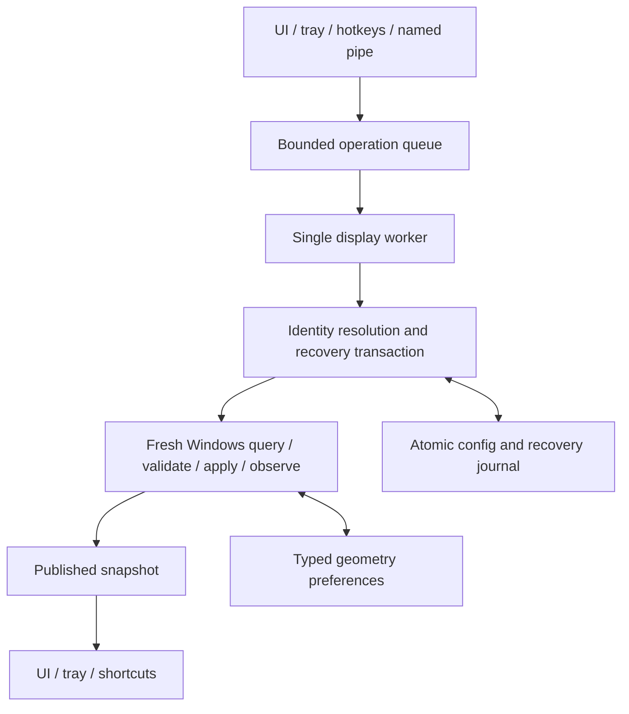

# Display operations and persistence

The core crate owns validated layouts, identity resolution, profiles, settings and recovery transactions. The Windows adapter owns native queries and mutations. Tauri owns scheduling, IPC and presentation. The browser mock is a separate transport implementation used for development.

## Ownership and scheduling

`app/coordinator.rs` owns the manager on one dedicated thread. At most 16 operations wait in its queue; callers get an explicit rejection when the queue is full. Commands use asynchronous response channels rather than blocking Tauri's executor. Snapshot reads clone the last published state under a short read lock and never enumerate or mutate displays.

The worker checks the confirmation watchdog before each queued operation. Recovery failures retry after 250 ms, 1 second and 2 seconds; exhaustion emits one failure notification and retains the pending transaction. Manual Revert or Restore can retry it. A new transaction gets a new retry budget. Topology notifications coalesce into refresh flags, with a two-second fallback poll. HDR calibration failures preserve the previous signature so the next poll retries. Shortcut registration is updated only when bindings change.

Native Win32 calls are synchronous and cannot be cancelled safely by the worker. A hung driver can still block mutation and recovery; it does not hold the published snapshot lock. Process isolation would be required for stronger cancellation guarantees. This implementation does not claim to solve arbitrary driver hangs.

## Display identity

`DisplayEndpoint(adapter_luid, target_id)` addresses a live Windows target. It is not a permanent physical identity. `MonitorIdentity` retains device-path evidence and a validated EDID serial qualified by manufacturer/product. Invalid EDID headers/checksums, missing serials and failed device queries remain unknown.

The shared resolver first accepts an exact endpoint with agreeing available evidence, then a unique serial, then a unique device path, then a unique connection hash. A known conflicting serial forbids connection-based fallback. A target number alone cannot identify a monitor on another adapter. An active candidate does not win merely because it is active. Multiple candidates return an explicit ambiguous result.

The `edid_hash` field is a connection fingerprint, not a complete EDID hash. Display keys contain three components: adapter LUID, target number and connection hash (or `-` when unknown). Stored fingerprints associate shortcut keys with monitor evidence. Current-format profiles and recovery layouts resolve their saved evidence against the live inventory at apply time; startup does not rewrite saved profiles. Missing or ambiguous monitors remain in supported configuration so reconnecting hardware can make them usable again.

Identical panels with missing or duplicated serials cannot be reliably distinguished after arbitrary port swaps. Monarch refuses ambiguous restoration. Reconnect to the saved port or re-save the profile after checking Windows' display arrangement. Indexed shortcut numbers follow the current inventory sorted by serial/path/connection evidence; adding or removing displays can change those numbers. Custom bindings retain monitor-specific keys.

## Observations and history

One `QDC_ALL_PATHS` result produces the connected inventory and its active layout. Alternative routes never imply that a monitor is active. Active-only queries verify a completed apply. Every published Windows snapshot has a generation number; profiles/settings/pending recovery are included in the same publication. If enumeration fails, the last observed display state remains published while transaction metadata still updates.

`monitor_geometry.json` stores versioned, validated positions, resolutions, refresh rates and rotations for up to 128 recent monitor records. History can complete an already enumerated inactive output's preferences; it cannot create a connected monitor or a native route. Multiple physical monitors may have used one runtime address. Fresh active geometry always wins.

Raw `DISPLAYCONFIG_PATH_INFO` and `DISPLAYCONFIG_MODE_INFO` arrays exist only during a native operation. Recovery rebuilds a complete target/source assignment from live candidates. The old native-byte cache is no longer read. Saved profiles and recovery layouts continue to supply their typed geometry.

## Transactions and configuration

1. Resolve and validate the requested layout and capture the current layout.
2. Atomically persist `pending_recovery` and the previous layout before the first mutation.
3. Apply and verify the observed active set, placement, logical-source primary status, rotation, resolution, fractional refresh, HDR, scaling and clone membership.
4. Start the confirmation interval only after apply succeeds. Unresolved failures remain pending with an immediate recovery deadline.
5. On confirmation, persist the new last-good layout and remove the journal. On rollback, verify restoration and persist it before removing the journal.

Startup reconstructs an unfinished journal as an immediately expired transaction. The worker attempts recovery before ordinary queued actions. Automation from profiles, hotkeys and the tray can auto-confirm only a successful operation. A persistence failure keeps recovery available.

Monarch 2.0 uses schema 3 for optional HDR/scaling preferences and clone groups.
Configurations and profiles from earlier schemas are reset;
there is no migration path. Geometry history has its own version 2 and rejects the
old format. Malformed data and unsupported schemas reset; filesystem failures remain
errors. Missing primary configuration never resurrects a backup. Valid current-format
profiles and recovery journals retain disconnected monitors.

Mutators clone state, save, then commit it in memory. File writes flush a unique temporary file before atomic replacement; Windows uses `MoveFileExW` with replacement and write-through. A supported previous config is retained as `config.json.bak` for manual recovery.

An output without an observed mode uses `0x0` geometry, which becomes an automatic mode preference at the planning boundary. Windows resolves automatic modes; exact preferences must pass preflight and observation. Explicit layouts reject duplicate endpoints, multiple primary sources and out-of-range values. Source coordinates describe desktop geometry; rotation is stored separately and must be present, with `null` representing an unknown orientation. Clone groups share position, source resolution, scaling and primary status; extended surfaces cannot overlap. Cloning is never inferred from rectangles, and saved groups never contain Windows source IDs. See [Microsoft's source-mode coordinate rules](https://learn.microsoft.com/en-us/windows/win32/api/wingdi/ns-wingdi-displayconfig_source_mode).

## Windows integration

Startup registration uses Win32 registry APIs and numeric status codes. Missing keys/values are successful when disabling startup, independent of language. Settings changes synchronize registration only if the startup preference changed; startup also reconciles the saved preference.

Wallpaper preservation has its own COM guard. It captures static images or slideshow contents/options plus enabled state, placement and color. A running slideshow is left alone unless Windows changed its mode; static images are restored only when changed. Interfaces are released before the apartment guard, including construction failures. Capture/restore is best effort when Windows denies access. The separate [slideshow and enable APIs](https://learn.microsoft.com/en-us/windows/win32/api/shobjidl_core/nn-shobjidl_core-idesktopwallpaper) matter because setting a static image can change slideshow/background state.

Instance mutex and pipe names include the user SID and Windows session ID. The named pipe rejects remote clients and grants access only to that user. It allows at most eight request readers and two profile requests in progress, alongside the worker's queue limit. Frames are limited to 8 KiB; reads and writes have three-second deadlines. A profile receives an acceptance response after successful queue submission, then a separate completion response with the same request ID. Completion waits up to 90 seconds. Timeout or disconnect after acceptance means the outcome is unknown; callers must not automatically resubmit.

## Validation and release

`tests/` covers recovery after failed mutation/restart, transaction failures, schema/backup handling, identity ambiguity, port changes, EDID validation, typed history and layout validation. Desktop tests cover native route assignment/verification, queue saturation, IPC framing/deadlines and numeric registry behavior in an isolated fixture key. The explicit hardware test stays ignored in ordinary test runs.

`yarn test` exercises asynchronous subscription disposal, the browser confirmation contract and version-bump fixtures, including a locked Cargo check. Both Cargo lockfiles are committed with release version changes. Release builds test core and desktop code using locked dependencies and create the permanent tag only after the Windows build succeeds. Keep Tauri, its runtimes and the CLI compatible when updating the lockfiles.

A Windows target source check on Linux can compile code and tests with `MONARCH_SKIP_TAURI_BUILD=1`; it does not execute Win32 calls or prove the MSI build. Hardware acceptance remains necessary for GPU/driver behavior, slideshow/disabled backgrounds, mixed adapters, dock changes, localized registry handling and multiple login sessions.

## Display editing and capabilities

The main preview stages position offsets against the observed layout. Dropped
monitors join adjacent edges and the preview checks for gaps/overlaps. Save layout
rebases the primary source to the origin and applies positions through the manager's
verified confirmation transaction. Per-monitor Settings dialogs have independent
drafts and Save settings applies directly. They contain primary, orientation, HDR,
scaling, duplication and independent resolution/refresh choices. Resolution changes
keep neighbouring source rectangles joined. Saving properties leaves unsaved position
offsets in the preview, which always uses the latest observed modes and preferences.
Profiles capture the current layout; only their audio preference can be edited independently.
Missing optional preferences preserve observed state. Geometry history is never
capability evidence.

Selecting Duplicate creates an explicit clone group for a mirrored desktop. Shared
resolution choices intersect every member's reported modes in desktop orientation;
scaling choices intersect their readable ranges. The initial draft keeps the selected
desktop's resolution if shared, otherwise the joining monitor's if shared, otherwise
the largest reported common resolution. Refresh rates remain target-specific: keep a
supported current rate or select the closest reported rate at the shared resolution.
HDR and rotation are retained per target. The dialog exposes rates for every member,
so a subsequent shared-resolution edit cannot leave an inaccessible invalid rate on
another monitor. Missing/incompatible capabilities reject joining without mutation.
Unrelated extended displays retain their modes.

The Windows planner chooses one route per target, one common source per clone group,
and distinct sources for extended surfaces. Position, primary and preference changes
reuse active source formats and target timings, including the original refresh-rate
rational, rather than reconstructing them from rounded display values. Changed modes
invalidate only their own old timing. Requests with an explicit refresh rate supply
progressive scan-line ordering for the non-interlaced DXGI mode list. Automatic
mode requests retain 0/0 refresh and unspecified ordering; unchanged targets retain
their observed ordering. Windows permits unspecified ordering only with automatic
refresh ([API requirement](https://learn.microsoft.com/en-us/windows/win32/api/wingdi/ne-wingdi-displayconfig_scanline_ordering)).
The planner submits the source/target mode table
to `SDC_VALIDATE`, then applies without `SDC_ALLOW_CHANGES`. Rejected requests log
route/mode indices, source rectangles and target timings for diagnosis. Native routing is queried
again before HDR and DPI setters, and all requested properties (including clone
membership) are observed before confirmation starts. Failed apply restores captured
native modes and preferences; the persisted recovery layout covers timeout/restart.
Wallpaper and SDR calibration recovery remain in the transaction.

The preview follows the [Windows source-surface layout rules](https://learn.microsoft.com/en-us/windows/win32/api/wingdi/ns-wingdi-displayconfig_source_mode):
source surfaces cannot overlap or leave gaps, and the primary source is at (0, 0).

Mode lists use DXGI rational refresh rates. A detached target or a cloned source
cannot supply another target's mode list; only its target-specific preferred mode
and any observed active mode are offered until it is extended. Windows validates
the complete combination again at apply. HDR probes the HDR-specific request before
falling back to the older advanced-color request. Scaling is isolated in
`backend/windows/scaling.rs`: the undocumented -3/-4 device-info requests are used
only for readable standard ranges, with no custom/global or registry scaling.

Hardware acceptance for these paths is tracked in [the Windows checklist](windows-hardware-checklist.md).

## Audio endpoints and profile transactions

`src/audio.rs` describes playback endpoints, optional profile preferences, and
per-role recovery defaults. The optional `audio_output` stores an opaque Windows
endpoint ID plus a friendly label. Existing schema-3 display-only profiles mean
Leave unchanged; this additive field does not import or migrate 1.x data.
Endpoint IDs are never parsed or matched by name. Device installation/driver updates
can replace IDs; users must then reselect the endpoint ([Windows endpoint identity](https://learn.microsoft.com/en-us/windows/win32/coreaudio/endpoint-id-strings)).

The Windows audio module enumerates render endpoints, including inactive devices,
using `IMMDeviceEnumerator`. Microphones are excluded. Enumeration, changes, and
bounded waits run on the existing coordinator worker; published snapshot reads stay
independent. The worker's two-second refresh also observes device/default changes.
Audio enumeration failures produce an unavailable reason without breaking display
snapshots. Each native operation owns its COM apartment/interfaces and frees returned
strings and property variants on success and error paths.

The default-endpoint setter is isolated in `audio_policy.rs`, using the
[IPolicyConfig ABI](https://github.com/amate/SetDefaultAudioDevice/blob/master/PolicyConfig.h).
This is an undocumented Windows interface: activation probes support, and every
write is verified through the documented Core Audio default-endpoint queries.
The selector sets console and multimedia roles; it does not set communications or
capture defaults. Recovery captures/restores all observable playback roles separately.
A role with no previous endpoint is left to Windows; Monarch cannot force an absent
default. Per-application device assignments, mute, and volume remain outside scope.

`save_profile`, `set_profile_audio`, and `set_audio_output` IPC operations go through
the same manager as UI/tray/shortcut/startup/CLI profile application. Saving an audio
preference never applies a layout or recaptures an existing profile. Manual switching
uses the durable transaction and auto-confirms after verification. Audio-only profile
application skips topology mutation and still uses confirmation.

Before display/audio mutation, the manager saves the layout and each observed audio
role in `pending_recovery` / `pending_recovery_audio`. It applies displays, waits up
to five seconds for all requested render endpoints to be active, sets requested roles,
then waits up to two seconds to observe them. Only then does confirmation begin.
An audio-stage failure immediately attempts complete rollback; a failed recovery
retains both journals for the watchdog, manual retry, or restart. Recovery restores
topology before audio, allowing HDMI endpoints to return. Native display rollback
also restores captured audio before its journal can clear. Last-layout restore
includes the associated `last_restorable_audio`. Display-only apply remains usable
when audio cannot be captured; explicit audio selection fails before mutation in
that case. Leave unchanged does not issue audio setters during successful apply,
although Windows itself may reroute audio when HDMI displays disappear.
