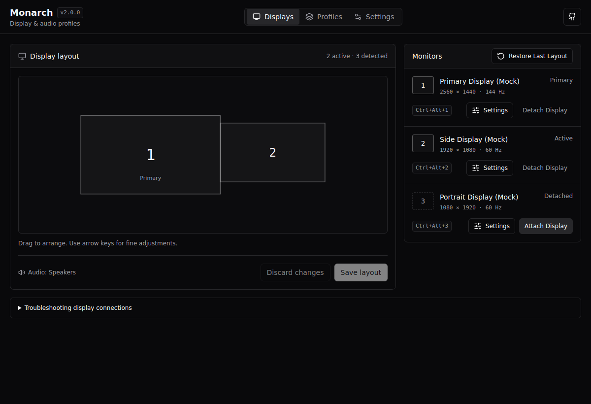
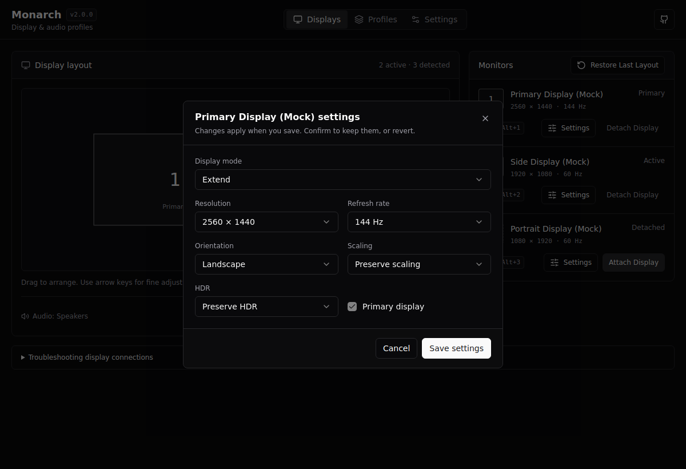
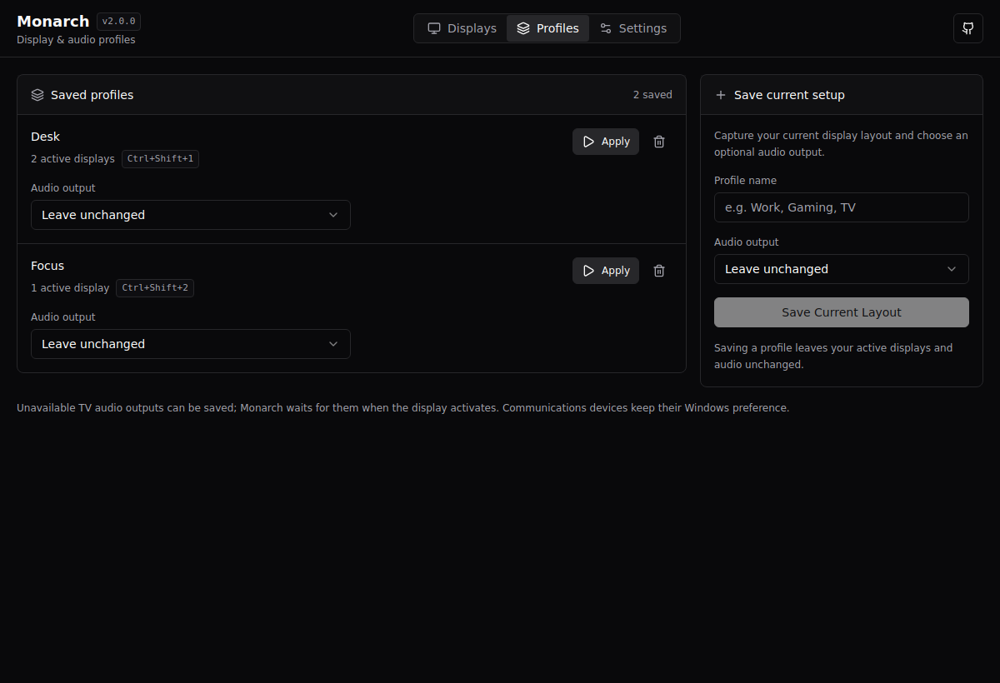
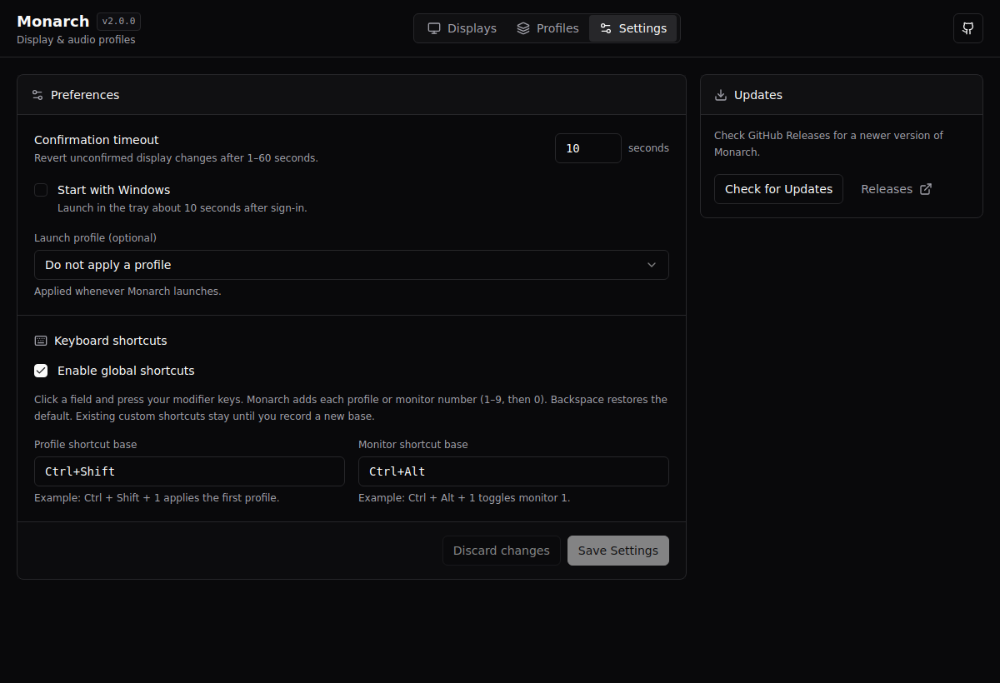

# Interface preview

Monarch uses the same zinc palette, Bahnschrift/Aptos font stack, compact buttons,
bordered panels and dropdown styling as [PipeMic](https://github.com/Nuzair46/PipeMic/tree/1356d474187ad2956dc8426fd0cb1360ef5862d5/src).
Shared theme values live in `web/styles.css`; controls live in `web/components/ui`.

These screenshots use the browser mock at 1200 × 820, Monarch’s default window
size. They demonstrate the interface, not a physical Windows display test.

## Displays

Drag or use arrow keys to arrange displays. Position changes remain drafts until
**Save layout**. The current Windows audio output appears in the layout footer.
Monitor **Settings** apply independently of the position draft.

## Monitor settings

Resolution and refresh rate remain separate. Dropdowns support keyboard navigation;
closing the dialog returns focus to its Settings button. The footer stays visible
when the properties need to scroll in a short window.

## Profiles

Audio outputs remain grouped by availability. Editing a profile’s audio does not
change the active system until the profile is applied. The save form also accepts Enter.

## Settings

Startup, confirmation and shortcut controls are grouped together. **Discard changes**
restores the saved preferences without applying them.

